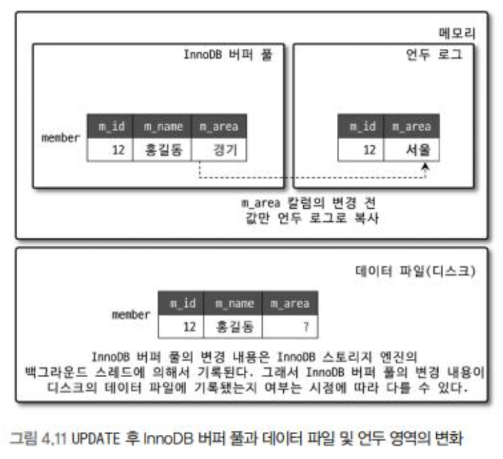

InnoDB는 MySQL에서 사용할 수 있는 스토리지 엔진 중 **거의 유일하게 레코드 기반의 잠금**을 제공한다.

## 2.1 프라이머리 키에 의한 클러스터링

InnoDB의 모든 테이블은 기본적으로 PK를 기준으로 클러스터링되어 저장된다. 즉, PK의 순서대로 디스크에 저장된다는 뜻이며, 모든 **세컨더리 인덱스는 레코드의 주소 대신 프라이머리 키의 값을 논리적인 주소로 사용**한다. PK가 클러스터링 인덱스이기 때문에 프라이머리 키를 이용한 레인지 스캔은 상당히 빨리 처리될 수 있다. 결과적으로 쿼리의 실행 계획에서 PK는 기본적으로 다른 보조 인덱스에 비해 비중이 높게 설정된다.

InnoDB 스토리지 엔진과는 달리 MyISAM 스토리지 엔진에서는 클러스터링 키를 지원하지 않는다. 따라서 **MyISAM 테이블에서는 PK와 세컨더리 인덱스는 구조적으로 아무런 차이가 없다**. 그리고 MyISAM 테이블의 PK를 포함한 모든 인덱스는 물리적인 레코드의 주소 값(ROWID)을 가진다.

## 2.2 외래 키 지원

외래 키에 대한 지원은 InnoDB 스토리지 엔진에서 지원하는 기능으로 MyISAM이나 MEMORY 테이블에서는 사용할 수 없다. 외래 키는 데이터베이스 서버 운영의 불편함 때문에 **서비스용 데이터베이스에서는 생성하지 않는 경우**도 있는데, 그렇다더라도 **개발 환경의 데이터베이스에서는 좋은 가이드 역할**을 할 수 있다.

수동으로 데이터를 적재하거나 스키마 변경 등의 관리 작업이 실패할 수 있다. 부모 테이블과 자식 테이블의 관계를 명확히 파악해서 순서대로 작업한다면 문제없이 실행할 수 있지만 외래 키가 복잡하게 얽힌 경우에는 그렇게 간단하지 않다.

> [!Note]
>
> ## Spring은 어떻게 웹 분야 1황이 되었는가?
>
> 객체간 의존관계가 복잡해지면 객체를 생성할 때 객체의 생성 순서가 굉장히 중요해지는데, 기존 서블릿 기반의 웹 서버의 경우 서비스가 커지면 커질 수록 이를 관리하기 너무 복잡하고 어려움. 이를 **스프링이 의존성을 관리해주겠다고 나타났으니**... 당연히 써야겠지?

## 2.3 MVCC(Multi Version Concurrency Control)

일반적으로 레코드 레벨의 트랜잭션을 지원하는 DBMS가 제공하는 기능. MVCC의 가장 큰 목적은 **잠금을 사용하지 않는 일관된 읽기를 제공**하는 데 있다. InnoDB는 **언두 로그(Undo log)를 이용**하여 이 기능을 구현한다. 여기서 멀티 버전이라하면 **하나의 레코드에 대해 여러 개의 버전이 동시에 관리**된다는 의미이다.

#### 예시를 살펴보자

1. 먼저 레코드 하나를 삽입하고 Commit을 수행하였다.

2. Update 쿼리를 발생시켰다 (하지만, Commit은 수행하지 않았다).

##### 이 상태에서 조회 쿼리를 실행하면 어떤 결과가 나오는가?

이 질문의 답은 데이터베이스에 설정된 격리 수준에 따라 다르다. 만약 격리 수준이 `READ_UNCOMMITED`인 경우 InnoDB 버퍼 풀이 현재 가지고 있는 변경된 데이터를 읽어서 반환한다. 즉, 데이터가 커밋됐든 아니든 변경된 상태의 데이터를 반환한다. **`READ_COMMITED`나 그 이상의 격리 수준(`REPEATABLE_READ`, `SERIALIZABLE`)의 경우**에는 아직 커밋되지 않았기 때문에 InnoDB 버퍼 풀이나 데이터 파일에 있는 내용 대신 변경되기 이전의 내용을 보관하고 있는 **언두 영역의 데이터를 반환**한다.

## 2.4 잠금 없는 일관된 읽기

InnoDB는 MVCC 기술을 이용해 잠금을 걸지 않고 읽기 작업을 수행한다. 격리 수준이 `SERIALIZABLE`이 아닌 경우 순수한 읽기 작업은 다른 트랜잭션의 변경 작업과 관계 없이 항상 잠금을 대기하지 않고 바로 실행된다. 이를 잠금 없는 일관된 읽기라고 표현하며, **InnoDB는 변경되지 전의 데이터를 읽기 위해 언두 로그를 사용**한다.

오랜 시간 동안 활성 상태인 트랜잭션으로 인해 MySQL 서버가 느려지거나 문제가 발생할 수가 있다. 일관된 읽기를 위해 작성된 언두 로그를 삭제하지 못하고 계속 유지해야 하기에 발생하는 문제이다. 트랜잭션이 시작됐다면 가능한 한 빨리 롤백이나 커밋을 통해 트랜잭션을 완료하는 것이 좋다.

## 2.5 자동 데드락 감지

InnoDB는 내부적으로 잠금이 교착 상태에 빠지지 않았는지 체크하기 위해 잠금 대기 목록을 그래프 형태로 관리한다. 스토리지 엔진 내부에 데드락 감지 스레드를 가지고 있어 주기적으로 잠금 대기 그래프를 검사해 교착 상태에 빠진 트랜잭션들을 찾아서 그 중 하나를 강제 종료한다. 이 때 어느 트랜잭션을 먼저 강제 종료할 것인지를 판단하는 기준은 **트랜잭션의 언두 로그 양이며, 언두 로그 레코드를 더 적게 가진 트랜잭션이 일반적으로 롤백의 대상이 된다.**

> [!Question]
>
> ##### 언두 로그를 적게 가진 트랜잭션이 제거 대상이 되는 이유는 무엇인가요?

InnoDB 스토리지 엔진은 상위 레이어인 MySQL 엔진에서 관리되는 테이블 잠금(LOCK TABLES 명령으로 잠긴 테이블)은 볼 수가 없어서 데드락 감지가 불확실할 수도 있는데, `innodb_table_locks` 시스템 변수를 활성화하면 InnoDB 스토리지 엔진 내부의 레코드 잠금 뿐만 아니라 테이블 레벨의 잠금까지 감지할 수 있게 된다.

일반적인 서비스에서는 데드락 감지 스레드가 트랜잭션의 잠금 목록을 검사해서 데드락을 찾아내는 작업은 크게 부담되지 않는다. 하지만 동시 처리 스레드가 매우 많아지거나 각 트랜잭션이 가진 잠금의 개수가 많아지면 데드락 감지 스레드가 느려진다. 데드락 감지 스레드는 잠금 목록을 검사하기 때문에 **잠금 상태가 변경되지 않도록 잠금 목록이 저장된 리스트에 새로운 잠금을 걸고** 데드락 스레드를 찾게 된다. 데드락 감지 스레드가 느려지면 서비스 쿼리를 처리 중인 스레드는 더는 작업을 진행하지 못하고 대기하면서 서비스에 악영향을 미치게 된다. 이렇게 동시 처리 스레드가 매우 많은 경우 데드락 감지 스레드는 더 많은 CPU 자원을 소모할 수도 있다.

위의 문제를 해결하기 위해 `innodb_deadlock_detect` 시스템 변수를 제공하며, 이를 OFF로 설정하면 데드락 감지 스레드는 더는 작동하지 않게 된다. 하지만, 이렇게 되면 데드락이 발생하면 트랜잭션은 무한정 대기하게 된다.

이를 해결하기 위해 `innodb_lock_wait_timeout` 시스템 변수를 활성화하면 일정 시간이 지나면 자동으로 요청이 실패하고 에러 메시지를 반환하게 된다. 이는 초 단위로 설정가능하며, 데드락 감지 스레드가 부담되어 OFF를 한 경우라면 **timeout 시간을 기본값인 50초보다 낮은 값으로 설정하여 사용할 것**을 권장한다.

## 2.6 자동화된 장애 복구

InnoDB에는 손실이나 장애로부터 데이터를 보호하기 위한 여러 가지 매커니즘이 탑재되어 있다. 이러한 매커니즘을 이용해 MySQL 서버가 시작될 때 완료되지 못한 트랜잭션이나 디스크에 일부만 기록된(Partial write) 데이터 페이지 등에 대한 일련의 복구 작업이 자동으로 진행된다.

InnoDB 데이터 파일은 기본적으로 MySQL 서버가 시작될 때 항상 자동 복구를 수행한다. 이 단계에서 자동으로 복구될 수 없는 손상이 있으면 자동 복구를 멈추고 MySQL 서버는 종료되어 버린다.

이 때는 MySQL 서버의 설정 파일에 `innodb_force_recovery` 시스템 변수를 설정해서 MySQL 서버를 시작해야 한다. 이 설정값을 통해 서버가 시작될 때 InnoDB 스토리지 엔진이 데이터 파일이나 로그 파일의 손상 여부 검사 과정을 선별적으로 진행할 수 있게 한다.

## 2.7 InnoDB 버퍼 풀

버퍼 풀은 디스크의 데이터 파일이나 인덱스 정보를 메모리에 캐시해 두는 공간이다. **쓰기 작업을 지연시켜 일괄 작업으로 처리할 수 있게 해주는 버퍼 역할**도 같이 한다.

### 2.7.1 버퍼 풀의 크기 설정

5.7 버전까지는 버퍼 풀의 크기를 변경할 수 없었지만, 8.0부터는 가능하도록 개선이 되었다. 그래서 가능하면 InnoDB 버퍼 풀의 크기를 **적절히 작은 값**으로 설정하여 조금씩 상황을 봐 가면서 증가시키는 방법이 최적이다.

> [!Note]
>
> ##### 적절히 작은 값?
>
> 운영체제의 전체 메모리 공간이 8GB 미만이라면 50% 정도만 InnoDB 버퍼 풀로 할당하고 나머지 메모리 공간은 MySQL 서버와 운영체제, 그리고 다른 프로그램이 사용할 수 있는 공간으로 확보해주는 것이 좋다. 전체 메모리 공간이 그 이상이라면 InnoDB 버퍼 풀의 크기를 전체 메모리의 50%에서 시작해서 조금씩 올려가면서 최적점을 찾는다.

버퍼 풀 크기 조정은 크리티컬한 변경으로 가능하면 MySQL 서버가 한가한 시점을 골라서 진행하는 것이 좋다. 버퍼 풀을 더 크게 변경하는 작업은 시스템 영향도가 크지 않지만, 버퍼 풀의 크기를 줄이는 작업은 서비스 영향도가 매우 크므로 가능하면 버퍼 풀의 크기를 줄이는 작업은 하지 않도록 주의하자.
버퍼 풀은 내부적으로 128MB 청크 단위로 쪼개어 관리된다. 이는 버퍼 풀의 크기를 줄이거나 늘리기 위한 단위 크기로 사용된다.

InnoDB 버퍼 풀은 전통적으로 버퍼 풀 전체를 관리하는 잠금(세마포어)으로 인해 내부 잠금 경합을 많이 유발해왔는데, 이런 경합을 줄이기 위해 **버퍼 풀을 여러 개로 쪼개어 관리할 수 있게 개선**되었다. 버퍼 풀이 쪼개지면서 개별 버퍼 풀 전체를 관리하는 **잠금(세마포어) 자체도 경합이 분산되는 효과**를 내게 되었다.

### 2.7.2 버퍼 풀의 구조

거대한 메모리 공간을 페이지 크기의 조각으로 쪼개어 InnoDB 스토리지 엔진이 데이터를 필요로 할 때 해당 데이터 페이지를 읽어서 각 조각에 저장한다. 버퍼 풀의 페이지 크기 조각을 관리하기 위해 InnoDB 스토리지 엔진은 크게 LRU(Least Recently Used) 리스트와 플러시(Flush) 리스트, 그리고 프리(free) 리스트라는 3개의 자료 구조를 관리한다

#### 프리 리스트

InnoDB 버퍼 풀에서 실제 사용자 데이터로 채워지지 않은 비어 있는 페이지들의 목록이며, 새롭게 디스크의 데이터 페이지를 읽어와야 하는 경우 사용된다.

#### LRU 리스트

디스크로부터 한 번 읽어온 페이지를 최대한 오랫동안 InnoDB 버퍼 풀의 메모리에 유지해서 디스크 읽기를 최소화하는 것이 목적인 리스트이다. InnoDB 스토리지 엔진에서 데이터를 찾는 과정은 대략 다음과 같다.

1. 필요한 레코드가 저장된 데이터 페이지가 버퍼 풀에 있는지 검사
    1. InnoDB 어댑티브 해시 인덱스를 이용해 페이지를 검색
    2. 해당 테이블의 인덱스(B-Tree)를 이용해 버퍼 풀에서 페이지를 검색
    3. 버퍼 풀에 이미 데이터 페이지가 있었다면 해당 페이지의 포인터를 MRU 방향으로 승급
2. 디스크에서 필요한 데이터 페이지를 버퍼 풀에 적재하고, 적재된 페이지에 대한 포인터를 LRU 헤더 부분에 추가
3. 버퍼 풀의 LRU 헤더 부분에 적재된 데이터 페이지가 실제로 읽히면 MRU 헤더 부분으로 이동(Read Ahead와 같이 대량 읽기의 경우 디스크의 데이터 페이지가 버퍼 풀로 적재는 되지만 실제 쿼리에서 사용되지는 않을 수도 있으며, 이런 경우에는 MRU로 이동되지 않음)
4. 버퍼 풀에 상주하는 데이터 페이지는 사용자 쿼리가 얼마나 최근에 접근했었는지에 따라 나이(Age)가 부여되며, 버퍼 풀에 상주하는 동안 쿼리에서 오랫동안 사용되지 않으면 데이터 페이지에 부여된 나이가 오래되고 결국 해당 페이지는 버퍼 풀에서 제거된다. 버퍼 풀의 데이터 페이지가 쿼리에 의해 사용되면 나이가 초기화 되어 다시 젊어지고 MRU의 헤더 부분으로 옮겨진다.
5. 필요한 데이터가 자주 접근됐다면 해당 페이지의 인덱스 키를 어댑티브 해시 인덱스에 추가

#### 플러시 리스트

디스크로 동기화되지 않은 데이터를 가진 데이터 페이지의 변경 시점 기준의 페이지 목록을 관리한다. 데이터 변경이 가해진 데이터 페이지는 플러시 리스트에 관리되고 특정 시점이 되면 디스크로 기록되어야 한다. **데이터가 변경되면 InnoDB는 변경 내용을 리두 로그에 기록하고 버퍼 풀의 데이터 페이지에도 변경 내용을 반영**한다.

### 2.7.3 버퍼 풀과 리두 로그

InnoDB 버퍼 풀은 데이터베이스 서버의 성능 향상을 위해 데이터 캐시와 쓰기 버퍼링이라는 두 가지 용도가 있는데, **버퍼 풀의 메모리 공간만 단순히 늘리는 것은 데이터 캐시 기능만 향상시키는 것**이다. InnoDB 버퍼 풀의 쓰기 버퍼링 기능까지 향상시키려면 InnoDB 버퍼 풀과 리두 로그와의 관계를 먼저 이해해야 한다.

#### 클린 페이지

디스크에서 읽은 후로 전혀 변경되지 않은 페이지

#### 더티 페이지

`INSERT`, `UPDATE`, `DELETE` 명령으로 변경된 데이터를 가진 페이지

더티페이지는 디스크와 메모리의 데이터 상태가 다르기 때문에 언젠가는 디스크로 기록돼야 한다. 하지만 더티 페이지는 버퍼 풀에 무한정 머무를 수 있는 것은 아니다. InnoDB 스토리지 엔진에서 리두 로그는 1개 이상의 고정 크기 파일을 연결해서 순환 고리처럼 사용한다. **데이터 변경이 계속된다면 언젠간 오래된 리두 로그는 새로운 리두 로그로 덮어 쓰이게 된다.** 그래서 InnoDB 스토리지 엔진은 전체 리두 로그 파일에서 재사용 가능한 공간과 당장 재사용 불가능한 공간을 구분해서 관리해야 한다. 이 때, 재사용 불가능한 공간을 활성 리두 로그(Active Redo Log)라고 한다.

리두 로그 파일의 공간은 계속 순환되어 재사용되지만 매번 기록될 때마다 로그 포지션은 계속 증가된 값을 갖게 되는데 이를 LSN(Log Sequence Number)이라고 한다. InnoDB 스토리지 엔진은 주기적으로 체크포인트 이벤트를 발생시켜 리두 로그와 버퍼 풀의 더티 페이지를 디스크로 동기화하는데, 이렇게 발생한 체크포인트 중 가장 최근 체크포인트 지점의 LSN이 활성 리두 로그 공간의 시작점이 된다.

## .7.4 버퍼 풀 플러시

5.6 버전까지는 더티 페이지 플러시 기능이 그다지 부드럽게 처리되지 않았다. 급작스럽게 디스크 기록이 폭증해서 MySQL서버의 사용자 쿼리 처리 성능에 영향을 받는 경우가 많았다. 하지만 5.7을 거쳐 8.0으로 업그레이드 되면서 더티 페이지를 디스크에 동기화하는 부분에서 예전과 같은 디스크 쓰기 폭증 현상은 발생하지 않았다.

InnoDB 스토리지 엔진은 다음과 같이 2개의 플러시 기능을 백그라운드로 실행한다

-   플러시 리스트 플러시
-   LRU 리스트 플러시

#### 2.7.4.1 플러시 리스트 플러시

InnoDB 스토리지 엔진은 리두 로그 공간의 재활용을 위해 **주기적으로 오래된 리두 로그 엔트리가 사용하는 공간을 비워야 한다.** 오래된 리두 공간을 지우려면 반드시 **디스크로의 동기화가 선행**되어야 한다. 이때 얼마나 많은 더티 페이지를 한 번에 디스크로 기록하느냐에 따라 사용자의 쿼리 처리가 악영향을 받지 않으면서 부드럽게 처리된다.

더티 페이지를 디스크로 동기화하는 스레드를 클리너 스레드라고 하는데, `innodb_page_cleaners` 시스템 변수는 클리너 스레드의 개수를 조정할 수 있게 해준다. 클리너의 개수가 버퍼 풀 인스턴스 개수보다 많은 경우에는 버퍼 풀 인스턴스의 설정 값으로 자동으로 변경한다. 즉, **하나의 클리너 스레드가 하나의 버퍼 풀 인스턴스를 처리하도록 자동으로 맞춰준다.**

버퍼 풀은 한계가 있기 때문에 무한정 더티 페이지를 유지할 수 없다. 기본적으로 InnoDB 스토리지 엔진은 전체 버퍼 풀이 가진 페이지의 90%까지 더티 페이지를 가질 수 있는데, 때로는 이 값이 너무 높을수도 있다. 이런 경우에는 `innodb_max_dirty_pages_pct`라는 변수를 이용해 더티 페이지의 비율을 조정할 수 있다. 일반적으로 InnoDB 버퍼 풀은 **더티 페이지를 많이 가지고 있을 수록 디스크 쓰기 작업을 버퍼링함으로써 여러 번의 디스크 쓰기를 한 번으로 줄이는 효과**를 극대화할 수 있다. 그래서 **그냥 기본 사양으로 유지하는 것이 좋다..(??)**

더티 페이지가 많을 수록 디스크 쓰기 폭발 현상이 발생할 가능성이 높아진다. 디스크로 기록되는 더티 페이지의 개수보다 더 많은 더티 페이지가 발생하면 버퍼 풀에 더티 페이지가 계속 증가하게 되고, **어느 순간 더티 페이지의 비율이 90%를 넘어가면 InnoDB 스토리지 엔진은 급작스럽게 더티 페이지를 디스크로 기록해야 한다**고 판단한다. 이 때, 디스크 쓰기 폭발이 발생하게 된다.

그래서 InnoDB 스토리지 엔진은 **일정 수준 이상의 더티 페이지가 발생하면 조금씩 더티 페이지를 디스크로 기록**하게 하고 있다. 기본 값은 10% 수준이다.

InnoDB 스토리지 엔진의 백그라운드 스레드가 수행하는 디스크 작업(주로 버퍼 풀의 더티 페이지 쓰기)을 제어하기 위해, `innodb_io_capacity`는 평상시 디스크가 적절하게 처리할 수 있는 I/O 수준을, `innodb_io_capacity_max`는 디스크가 최대 성능을 발휘할 때의 I/O 한계를 설정하는 시스템 변수이다. 다만, InnoDB는 사용자 쿼리 처리를 위해 디스크 읽기도 수행하므로, **실제 디스크가 초당 1000 TOPS를 처리할 수 있다고 해서 이 값을 그대로 변수에 반영하면 안 된다.**

일일이 서버의 트래픽을 봐가면서 `innodb_io_capacity`를 조정하는 것은 상당히 번거로운 일이 될 것이다. InnoDB 스토리지 엔진은 어댑티브 플러시라는 기능을 제공한다. 어댑티브 플러시 기능이 활성화되면 `innodb_io_capacity` 설정값에 의존하지 않고 새로운 알고리즘을 사용한다. 리두 로그가 어느 정도 속도로 증가하는지 분석하여 적절한 수준의 더티 페이지가 버퍼 풀에 유지될 수 있도록 조절하는 기능이다.

마지막인데, `innodb_flush_neighbors` 시스템 변수는 디스크에서 근접한 페이지 중에서 더티 페이지가 있다면 InnoDB 스토리지 엔진이 함께 묶어서 디스크로 기록하게 해주는 기능을 활성화할지 결정한다. 하드 디스크에선 효과가 좋았지만, SSD 시스템에선 효과가 거의 없으니 비활성 모드로 유지하는 것이 좋다.

#### 2.7.4.2 LRU 리스트 플러시

LRU 리스트에서 사용 빈도가 낮은 데이터 페이지를 제거하여 새로운 페이지를 읽어올 공간을 만들어야 하는데, 이 때 LRU 리스트 플러시 함수가 사용된다. LRU 리스트의 끝부분부터 시작해서 `innodb_lru_scan_depth` 시스템 변수에 설정된 개수만큼의 페이지들을 스캔한다. 이 때 스캔하면서 더티 페이지는 디스크에 동기화하며, 클린 페이지는 즉시 프리 리스트로 페이지를 옮긴다.

버퍼 풀 인스턴스 별로 최대 `innodb_lru_scan_depth` 만큼 스캔하기 때문에 LRU 리스트의 스캔은 `인스턴스 수 * innodb_lru_scan_depth` 만큼 발생한다.

### 2.7.5 버퍼 풀 상태 백업 및 복구

버퍼 풀에 데이터가 준비된 상태라면 쿼리 성능이 꽤나 최적화된 상태겠지만, 서버가 방금 시작되거나 그렇다면 데이터가 없어 디스크를 읽는 시간 때문에 평상시보다 1/10 도 안나올 수 있다. 이 때 **디스크의 데이터가 버퍼 풀에 적재되있는 상태를 워밍업(Warming Up) 상태**라고 한다.

5.6 버전 부터는 `innodb_buffer_pool_dump_now` 시스템 변수를 이용해 버퍼 풀의 상태를 백업할 수 있다.
`innodb_buffer_pool_dump_now` 변수를 이용해 백업된 버퍼 풀의 상태를 다시 복구할 수도 있다.

버퍼 풀의 백업은 적재된 데이터 페이지의 메타 정보만 가져와서 저장하기에 매우 빠르게 진행되지만, 로드의 경우 메타데이터를 기반으로 디스크를 긁어와야 하기 때문에 상당한 시간이 걸릴 수 있다.

### 2.7.6 버퍼 풀의 적재 내용 확인

5.6 버전 부터 `information_schema` 데이터베이스의 `innodb_buffer_page` 테이블을 이용해 InnoDB 버퍼 풀의 메모리에 어떤 테이블의 페이지들이 적재돼 있는지 확인할 수 있었다.

## 2.8 Double Write Buffer

리두 로그는 리두 로그 공간의 낭비를 막기 위해 페이지의 변경된 내용만 기록한다. 이로 인해 InnoDB의 스토리지 엔진에서 더티 페이지를 디스크 파일로 플러시할 때 일부만 기록되는 문제가 발생하면 그 페이지의 내용은 복구할 수 없을 수도 있다. 페이지가 일부만 기록되는 현상을 Partial Page 또는 Ton Page라고 하는데, 이런 현상은 하드웨어의 오작동이나 시스템의 비정상 종료 등으로 발생할 수 있다.

1. 실제 데이터 파일에 변경 내용을 기록하기 전에 'A'~'E'까지의 더티 페이지를 우선 묶어서 한 번의 디스크 쓰기로 시스템 테이블스페이스의 DoubleWrite 버퍼에 기록한다.
2. 각 더티 페이지를 적당한 위치에 하나씩 랜덤으로 쓰기를 실행한다.

InnoDB 스토리지 엔진은 재시작될 때 항상 DoubleWrite 버퍼의 내용과 데이터 파일의 페이지들을 모두 비교하여 다른 내용을 담고 있는 페이지가 있으면 DoubleWrite 버퍼의 내용을 데이터 파일의 페이지로 복사한다.
