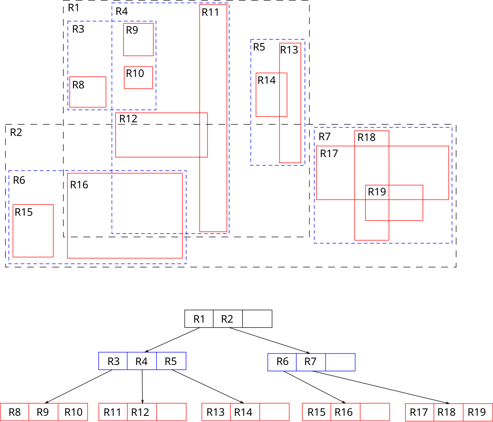

# 공간 인덱스(Spatial Index)

공간 인덱스는 **공간 데이터(위치, 영역, 거리 등의 지리적 정보)를 빠르게 검색하고 처리**할 수 있도록 설계된 데이터 구조이다. 기존의 일반적인 데이터베이스 인덱스(B-Tree, Hash Index)는 1차원적인 데이터를 효율적으로 검색할 수 있지만, 2차원 이상의 공간 데이터를 다루기에는 비효율적이다. 이러한 문제를 해결하기 위해 공간 인덱스는 공간적인 관계를 빠르게 조회할 수 있도록 설계되었다.

> ## 공간 인덱스를 공부하는 이유
>
> 오랜 기획 끝에 위치 기반의 메시징 서비스를 기획하게 되었는데, 특정 위치를 기준으로 빠르게 조회할 수 있는 기술이 필요했다.
> 3일차 학습은 **위치 기반 조회 기술 적용**을 위한 선행 학습이다.

## 3.1 공간 데이터의 특징

공간 데이터는 일반적인 숫자 또는 문자열 데이터와는 다른 **고유한 특성**을 가지고 있다.

-   **다차원 데이터**: (x, y) 또는 (x, y, z)와 같이 다차원적인 값으로 표현됨
-   **연속성**: 공간 데이터는 개별적인 값이 아니라 영역 또는 점의 집합으로 존재
-   **복잡한 질의**: "A 지역과 B 지역이 겹치는가?", "가장 가까운 지점을 찾아라" 등의 질의가 일반적
-   **큰 데이터 크기**: 공간 데이터는 점, 선, 면, 다각형 등의 구조를 가지므로 데이터 크기가 커질 수 있음

## 3.2 공간 인덱스의 필요성

공간 데이터를 일반적인 방법으로 저장하면 **위치 기반 검색**이 매우 느려질 수 있다. 따라서 공간 인덱스를 사용하여 효율적인 검색을 수행해야 한다.

### 3.2.1 공간 인덱스의 주요 기능

-   특정 좌표(점, 선, 다각형 등)와 관련된 데이터의 **빠른 조회**
-   두 공간 객체 간의 **위치 관계(포함, 교차, 인접 등) 연산 최적화**
-   거리 기반 검색의 성능 향상
-   공간 쿼리 최적화(SQL의 `ST_Intersects`, `ST_Distance`등과 결합)

## 3.3 주요 공간 인덱스 종류

공간 인덱스에는 여러 가지 유형이 있으며, 대표적으로 **R-Tree, Quadtree, Grid Index, S2, H3** 등이 있다.

### 3.3.1 R-Tree (Rectangle Tree)

-   공간 데이터를 **계층적으로 사각형(Bounding Box) 그룹으로 묶어** 저장하는 구조
-   검색 시 트리 구조를 따라가면서 **불필요한 영역을 배제**하여 탐색 속도를 높임
-   **대표적인 공간 인덱스 알고리즘**이며, PostgreSQL(PostGIS), MySQL 등에서 사용

#### 3.3.1.1 R-Tree 구조



-   루트 노드 -> 내부 노드 -> 리프 노드(실제 공간 데이터)
-   각 노드는 자신이 포함하는 **최소 경계 사각형(MBR, Minimum Bounding Rectangle)** 정보를 저장
-   특정 공간 객체를 검색할 때, **겹치지 않는 MBR은 탐색하지 않고 건너뛰어 성능을 향상**시킴

##### 장점

-   공간 객체의 크기와 관계없이 잘 작동
-   `ST_Intersects`, `ST_contains`등의 공간 연산을 빠르게 수행

##### 단점

-   데이터가 **동적으로 많이 변경**될 경우 성능 저하 가능
-   균형이 깨질 경우 성능 저하 -> R\*-Tree(균형 유지) 방식이 있음음

### 3.3.2 Quadtree

-   2차원 공간을 **4개의 균등한 사각형으로 계속 분할하는 방식**
-   지리 정보 시스템(GIS), 이미지 압축, 게임 맵 로딩 등에 자주 사용됨

#### 3.3.2.1 R-Tree 구조

1. 공간을 4등분하여 트리의 각 노드에 저장
2. 특정 공간 객체가 많은 지역은 다시 4등분하여 세분화
3. 객체가 없는 공간은 저장하지 않음

##### 장점

-   **비균일한 데이터 분포에도 효율적** (도심, 산지 등의 밀도 차이 반영 가능)
-   **포인트 데이터 검색**이 빠름 (특정 위치의 데이터 조회)

##### 단점

-   **큰 면적을 가진 공간 객체를 다룰 때 비효율적** (너무 많이 쪼개질 가능성 있음)
-   **동적 데이터 업데이트가 어려움** (트리 재구성이 필요할 수 있음)

### 3.3.3 Grid Index

-   전체 공간을 일정한 크기의 **격자로 나누고** 각 셀에 공간 객체를 저장
-   `GeoHash`와 같은 방식이 대표적인 예

##### 장점

-   **빠른 검색**: 특정 좌표가 포함된 그리드 셀만 조회하면 되므로 속도가 빠름
-   **구현이 단순**하여 NoSQL, 분산 시스템에서 자주 사용

##### 단점

-   **객체의 크기가 클 경우 비효율적** (한 객체가 여러 그리드에 걸쳐 저장될 수 있음)
-   **불균일한 데이터 분포에 취약** (도심과 시골의 밀도 차이를 고려하기 어려움)

## 3.4 공간 인덱스 예제 (PostgreSQL)

### 3.4.1 PostGIS 확장 기능 활성화

```SQL
CREATE EXTENSION postgis;
```

### 3.4.2 공간 데이터 테이블 생성

```SQL
CREATE TABLE comments (
    id SERIAL PRIMARY KEY,
    message VARCHAR(255),
    author INTEGER,
    geom GEOMETRY(Point, 4326)
);
```

### 3.4.3 공간 인덱스 생성

```SQL
CREATE INDEX comments_geom_idx
ON comments
USING GIST (geom);
```

### 3.4.4 반경 2km 내의 장소 조회

```SQL
SELECT id, message, ST_AsText(geom)
FROM places
WHERE ST_DWithin(geom, ST_SetSRID(ST_MakePoint(126.9707, 37.5530), 4326), 2000);
```
